# Quake Report

This Android application uses the U.S. Geological Survey (USGS) Earthquake Hazards Program API to provide users with real-time information about earthquakes around the world.

This app demonstrates the following views and techniques:

* [Retrofit](https://square.github.io/retrofit/) to make api calls to an HTTP web service
* [RxJava3](https://github.com/ReactiveX/RxJava) for multithreading
* [Google Maps API](https://developers.google.com/maps/documentation/android-sdk) to display earthquake locations on map

It leverages the following components from the Jetpack library:

* [ViewModel](https://developer.android.com/topic/libraries/architecture/viewmodel)
* [LiveData](https://developer.android.com/topic/libraries/architecture/livedata)
* [Room](https://developer.android.com/training/data-storage/room)
* [Data Binding](https://developer.android.com/topic/libraries/data-binding/) with binding adapters
* [Navigation](https://developer.android.com/topic/libraries/architecture/navigation/) with the SafeArgs plugin for parameter passing between fragments

## Features
* Displays a list of recent earthquakes, including magnitude, location, and time
* Allows users to filter earthquakes by magnitude, location, and time
* Shows earthquake details on a map
* Provides links to additional information about earthquakes from the USGS
* Dark mode

## Screenshots

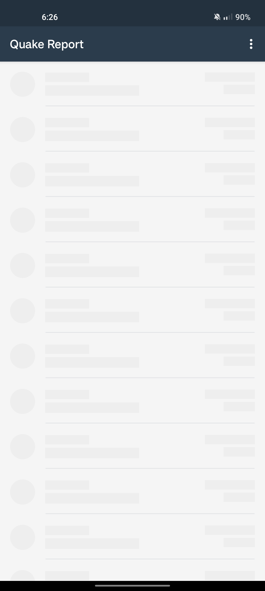
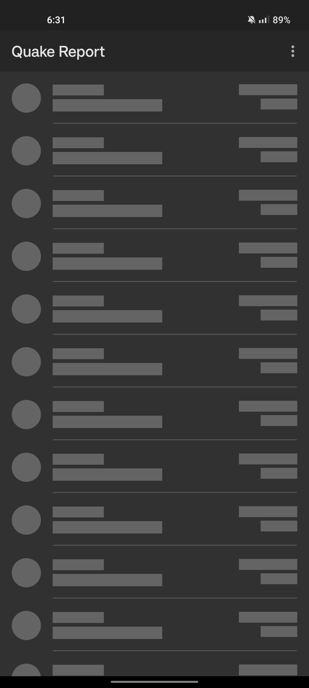
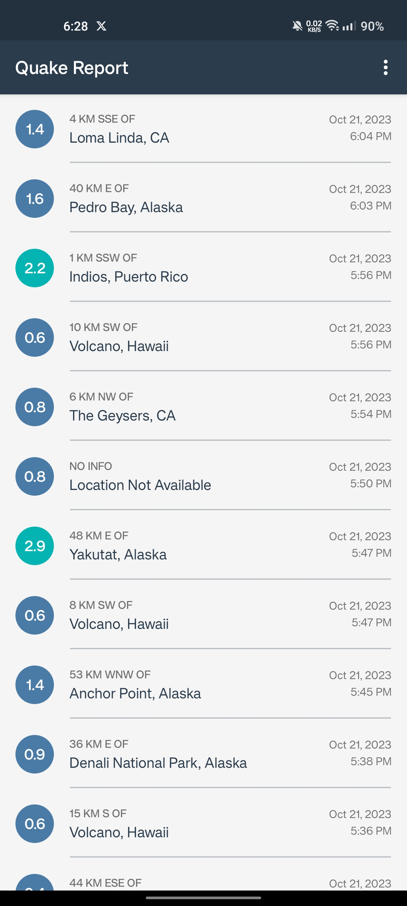
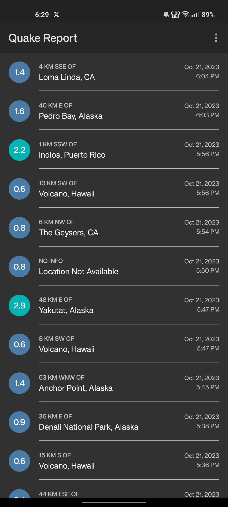
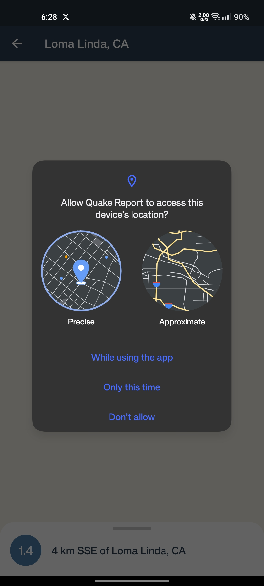
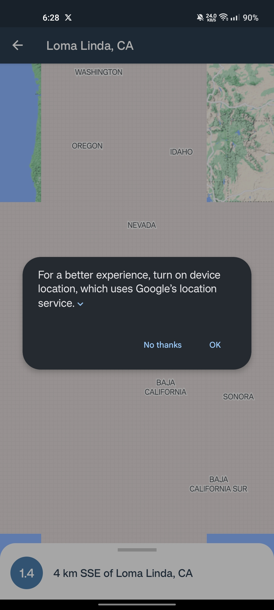
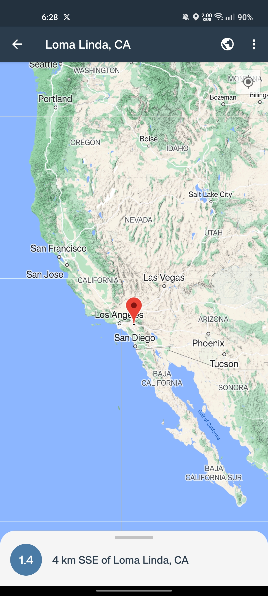
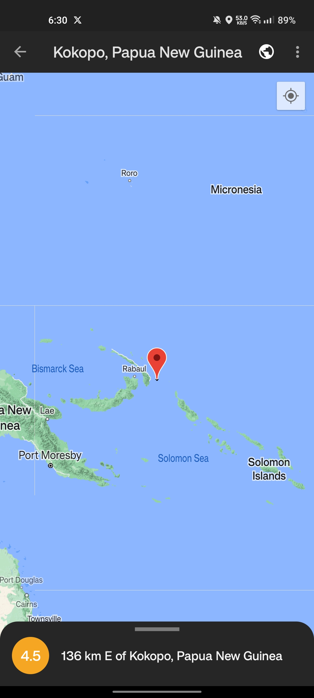
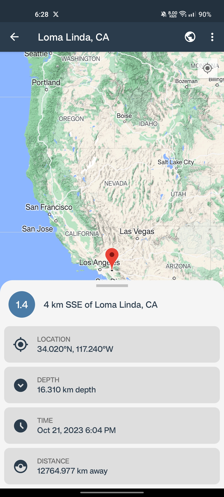
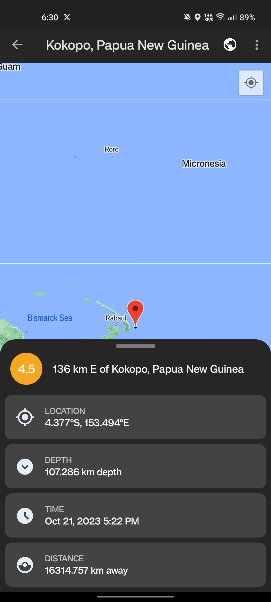
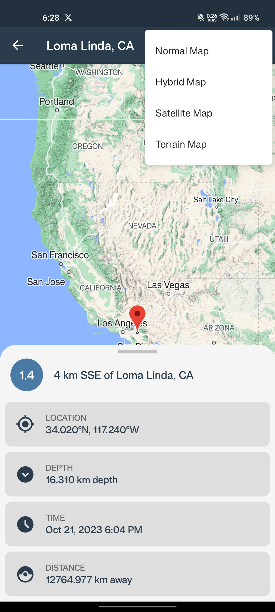
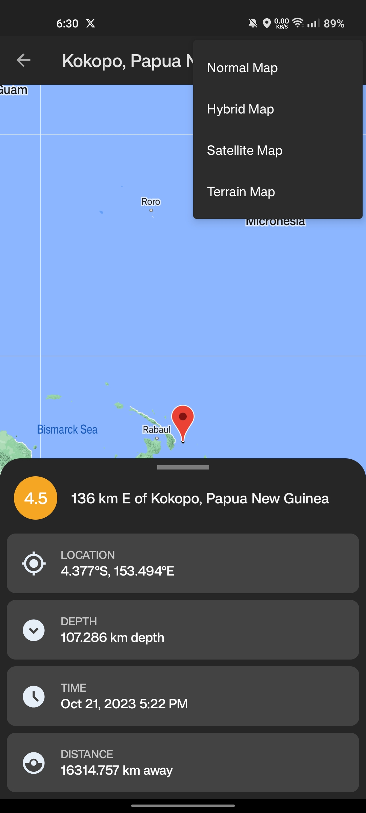
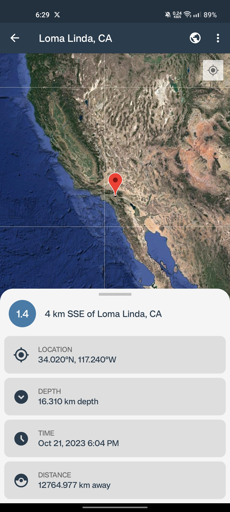
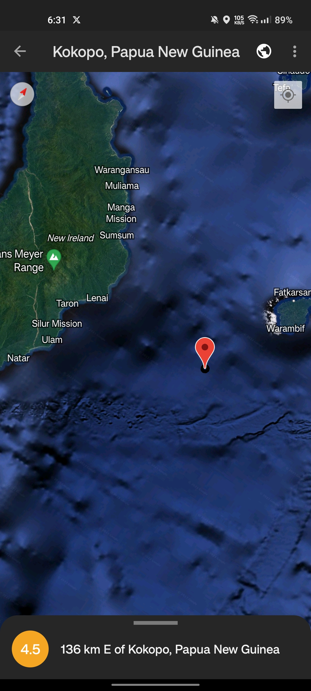
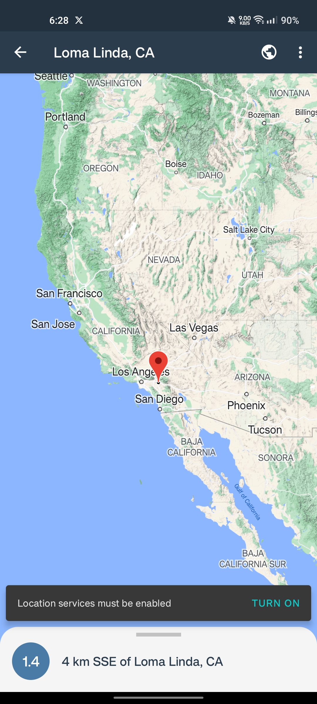
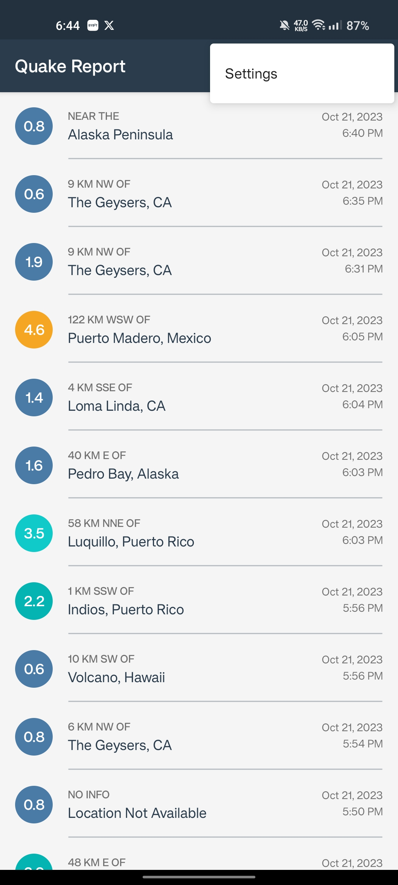
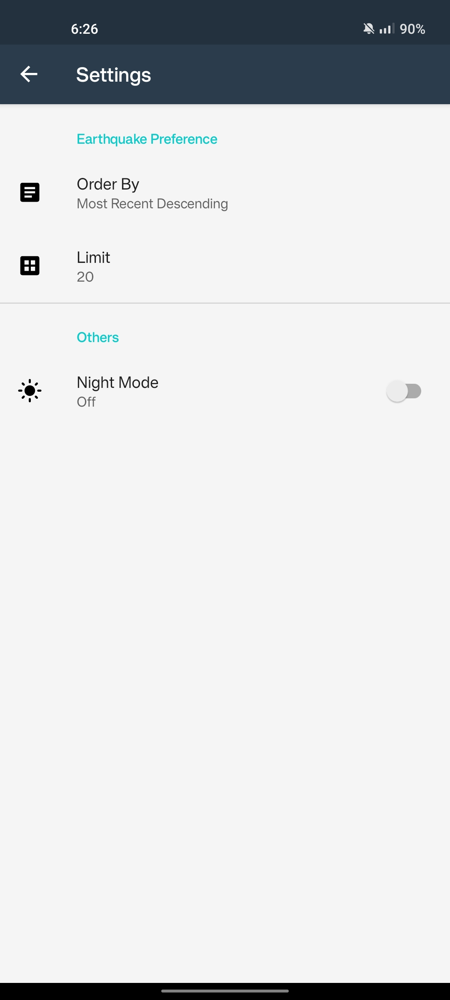
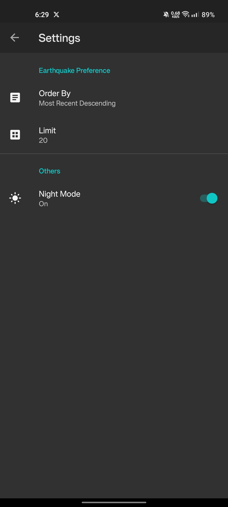
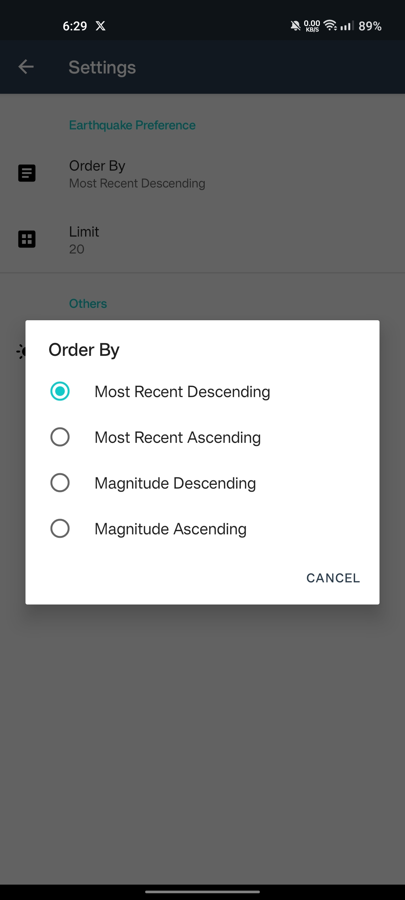
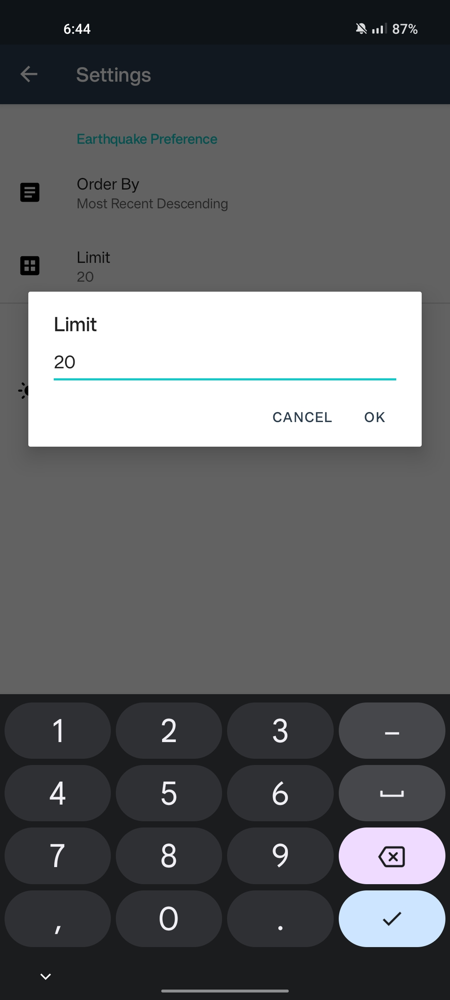

## Requirements
* Android SDK v23 or higher
* Android Build Tools v30.0.3 or higher
* Google Play Services

## Setup
* Clone the repository.
* Open the project in Android Studio.
* Build and run the app.

## Contributing
Contributions are welcome! Please feel free to fork the repository and submit pull requests.

## Licensing
This project is licensed under the MIT License. See the LICENSE file for more information.
